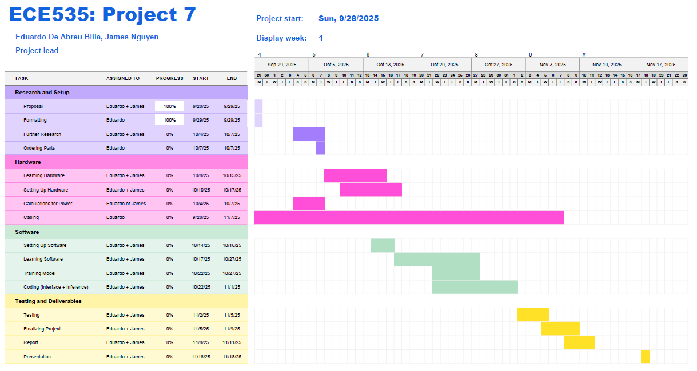

# Project 7: Smart Doorbell
Eduardo De Abreu Billa, James Nguyen

## Motivation
### Develop a cost efficient smart doorbell as an alternative to current popular camera doorbell devices. Cheaper doorbells featuring cameras typically do not have object recognition, and have less features than their more expensive counterparts. More popular alternatives (Such as Ring and Amcrest) are more expensive, and sometimes even feature subscription services.

## Design Goals
### This project will have several design goals. The project will be able to wirelessly connect to a host machine via the internet, and then send a real time feed of the camera upon detecting motion/people. The doorbell will send a notification/alert depending on the visitor detected, to keep the user apprised of any visitors approaching their door. Should the user miss the notification, these will also be saved to the battery powered Raspberry Pi. The images/videos will then be transferred to the host machine should the user wish to store or view them at a later time.
* Motion tracking capabilities
  * Record on motion
* Cost-effective
* Image/Video capture
  * Live feed
* Long battery life (Ideally meet industry standards)
* Real time notifications/alerts
* Notify if battery is low
* Wireless connection to host
* Visitor Identification
  * Capable of identifying household members
  * Capable of identifying strangers
* If time permits: Identifying specific people (delivery drivers, mail, etc.)

## Deliverables
### The deliverables for this project are listed below: 
* Understanding the process of deploying ML models on Raspberry Pi
* Implement an object detection model using TensorFlow Lite
* Building a system that captures an image when someone appears at the door, then classifies it
* Add an optional alert mechanism
* Add optional features such as detecting people of interests, such as delivery drivers of package delivery
* Final output consisting of code snippet and demonstration of inference directly on Raspberry Pi

## Hardware Requirements
### A raspberry pi will be the central processing unit for the logic required in object detection. It will have a camera connected to it, which will be taking videos and images and the raspberry pi will be powered by a battery source, which will be optimized to allow a longer battery life. A host machine (anything capable of running the doorbell software) will be required to view the notifications, feed, as well as the images and videos from the doorbell.

## Software Requirements
### The software used for this project will consist of three softwares: Python, Google Collab, and TensorFlow Lite (Lite RT). Python will be used for programming and data processing. Google Collab will be used for training the model. TensorFlow Lite will be used for running the model on the Raspberry Pi.

## System Blocks

## Roles & Timeline
### Roles and responsibilities will be as follows:
Eduardo:
* Updating and Managing ReadMe
* Gantt Chart
* Hardware
* Software
* Host machine to embedded system interfacing

James:
* System Blocks
* Hardware
* Software
* Host machine to embedded system interfacing.

  
Gantt format obtained from Microsoft

## References
A lightweight CNN paper on edge vision (https://arxiv.org/abs/1704.04861)  
Power Supply (https://resources.pcb.cadence.com/blog/2023-power-supply-design-for-embedded-systems)  
Raspberry Pi (https://www.raspberrypi.com/)  

